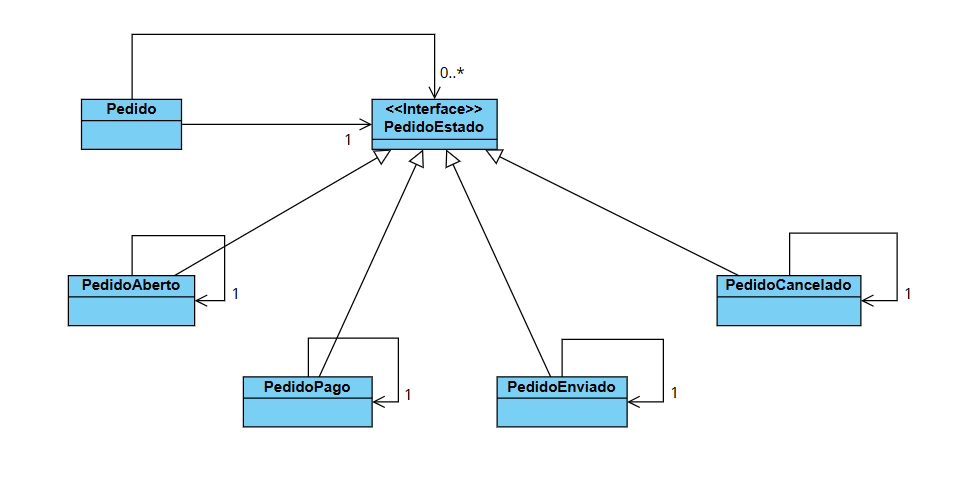

# Sistema de Pedidos - Padrão Memento

Este projeto apresenta uma implementação prática do padrão de projeto comportamental **Memento** em Java, aplicado a um contexto de **Gestão de Pedidos de E-commerce**.

O objetivo é permitir que um objeto `Pedido` tenha seu histórico de estados (status) salvo e restaurado, facilitando operações de desfazer ou auditoria de alterações.

## Sobre o Padrão Memento

O **Memento** é um padrão de projeto que permite capturar e externalizar o estado interno de um objeto para que ele possa ser restaurado para esse estado mais tarde, sem violar o encapsulamento.

Neste exemplo:
* **Originator:** A classe `Pedido`, que possui o estado atual e cria o memento (neste caso, adicionando à lista interna).
* **Memento:** Representado pela lista de estados históricos armazenada dentro de `Pedido`.
* **Caretaker:** No exemplo simplificado, a própria classe `Pedido` gerencia o histórico (`List<PedidoEstado> memento`), mas em implementações mais complexas, isso poderia ser externo.

## Estrutura do Código

### Classes de Domínio
* **Pedido:** Classe principal que gerencia o estado atual e o histórico (memento).
* **PedidoEstado:** Interface que define o contrato para os estados.

### Estados Concretos (Singleton)
Implementam os comportamentos específicos de cada status do pedido:
* **PedidoEstadoAberto**
* **PedidoEstadoPago**
* **PedidoEstadoEnviado**
* **PedidoEstadoCancelado**

## Diagrama de Classes

